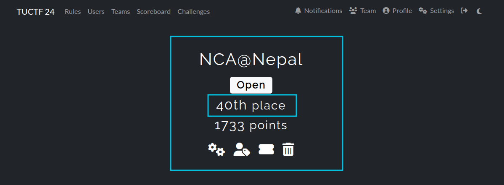

Hello, this is a write-up for forensics challenges in TUCTF 2025. I am part of the NCA@Nepal team, and we got 40th place in the event.

[**Link to TUCTF 2025**](https://ctfd.tuctf.com/challenges)



We solved all the challenges given in the forensics category and got a total of 430 points from them.

Let's move on to them.
<br>

## 1. Mysterious Presentation: 50 Points


In this challenge, a .pptx file was provided to us named 'quantum_propulsion_via_dank_memes.pptx.'

As soon as I saw it was a pptx, I tried unzipping it as it's for a forensics challenge.

```bash
unzip quantum_propulsion_via_dank_memes.pptx
```

After the pptx is unzipped, we obtain these files.


As you may have already noticed, there is a 7z archive named 'secret_data'.


After extracting it using 7z,

```bash
7z x secret_data.7z
```

Nice! We get a folder named secret_data, which contains a txt file named flag.txt


### Flag: TUCTF{p01yg10+_fi1e5_hiddin9_in_p1@in_5i9h+}
<br>

## 2. Security Rocks: 50 Points


In this challenge, we are given a .cap file to check. Let's dive deep into this.

After opening the file in Wireshark, we see that it is encrypted IEEE 802.11 captures.


To decrypt the captured data, we need to add the wpa-pwd key in Wireshark preferences for IEEE 802.11.

I had some encounters with captures like this previously, so I was prepared for this.

We need to use aircrack-ng along with the rockyou wordlist as suggested by the name to get the wpa-pwd.

```bash
aircrack-ng dump-05.cap rockyou.txt
```


I found the key after some time. It is **youwontguessit92**

Now, let's add the key to Wireshark.

We know the SSID from the first beacon frame. It is **securityRocks**. 


To add the key, we will go to **Edit > Preferences > Protocols > IEEE 802.11 > Decryption Keys,** or you can just use the shortcut **Ctrl+Shift+P** to get to preferences. 


After adding the key as shown below,


We can get the decrypted data.

Now let's look for TCP streams. We can add the 'tcp' filter for this. Let's follow these streams.

In TCP stream 1, we get the following data:


It is encoded using base62. I used [dcode.fr](http://dcode.fr) for this.


And we get the flag.

### Flag: TUCTF{w1f1_15_d3f1n173ly_53cure3}
<br>

## 3. Packet Detective: 50 Points


This challenge had a .pcap file given to us. We need to analyze it to get the flag.

<span style="font-size: 20px;">**WireShark**</span>

This challenge was pretty easy.

If we check the protocol hierarchy statistics, we get the following:


As shown above, there are some data packets. So, I checked it first using the 'data' filter.


There are only 9 packets with data.

The last one contains the following:


This matches the flag format given to us. We got the flag.

### Flag: TUCTF{N3tw0rk_M4st3r}
<br>

## 4. Bunker: 280 Points


This challenge had given us a .7z archive, which contained two files:


Using the 'file' command, let us attempt to determine what these files are:


One is a KeePass password database, while the other is a Mini DuMP crash report.

I had seen an article where you can extract the KeePass DB master key using the memory dump of the time when the password was entered. I have linked the GitHub repo of the researcher who found this.



The Python implementation of this exact CVE was done by this developer:




I used the original PoC with the dump file provided to us. You need dotnet installed on your machine to run this:

```bash
dotnet run ../Bunker_DMP ../Bunker_DB
```


It gave us a possible password, with the first character unidentified and the second character being one of the 11 characters listed inside {}.

After that, I asked ChatGPT to create a Python script to brute force the password.

This is the script:

```python
from pykeepass import PyKeePass
import string

# Define the range of possible characters
second_characters = ['L', 'Ï', '§', 'y', 'H', 'q', '$', 'W', 'A']
first_characters = ''.join(chr(i) for i in range(32, 256))  # Extended ASCII
known_characters = '0Ry_2_M4nk1Nd!_Y0RH4'
# Path to your KeePass database
db_path = "Bunker_DB"

# Brute-force loop
for first_char in first_characters:
    for second_char in second_characters:
        password = first_char + second_char + known_characters
        try:
            kp = PyKeePass(db_path, password=password)
            print(f"Success! The password is: {password}")
            exit(0)
        except Exception as e:
            pass  # Ignore incorrect passwords

print("Password not found.")
```

This uses the 'pykeepass' library. So we need to get it using pip or apt:

```bash
pip3 install pykeepass
# OR
sudo apt install python3-pykeepass
```

After running the script for some time, we get the key.


Now, let's open it. I am using KeePassXC for this.


Checking the recycle bin, we see this:


But it shows redacted. Let's check more thoroughly.

If we double-click on the entry, the record window opens, and we have some notes.


After combining all the parts and checking on CyberChef, it shows that it is in hex.


Let's translate it.


The challenge creator is really unhappy with humanity. 👹

Let's look back into the KeePass record.

After scrolling down on the left pane, we see a history tab. Clicking on it, we see that the record was modified.


Let's check this out. Double-click on it and unhide the password field.


Yay! We got the flag.

### Flag: TUCTF{Th1s_C4nn0T_ConT1nu3}
<br>

## Conclusion

The **TUCTF 2025 Forensics Challenges** provided an exciting opportunity to apply real-world forensic techniques in a competitive setting. From uncovering hidden files in a PowerPoint presentation to decrypting network traffic and extracting passwords from memory dumps, each challenge required a combination of analytical thinking, technical expertise, and creative problem-solving.

Our team, **NCA@Nepal**, secured **40th place**, successfully solving all forensic challenges and earning **430 points**. While the competition tested our knowledge of **file forensics, network analysis, cryptography, and memory forensics**, it also highlighted the importance of automation, scripting, and efficient forensic methodologies.

I hope to see even more **diverse and complex forensic challenges** in future CTFs, including **digital forensics and incident response (DFIR), malware analysis, and steganography**. The experience reinforced our passion for cybersecurity, and we look forward to tackling even more advanced challenges in the next competition! 🚀🔍